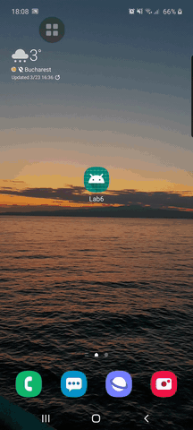

* In this laboratory, we had at first instance to understand certain concepts used for local data storage with the help of SharedPreferences. 
* The first exercise consisted of creating the layout of the first activity and of course looking for a png to make it look 
 like the one in the lab. We had to add 2 buttons and an editText in which we will add some message in the future which will be displayed in a new activity.
* The second exercise consisted of creating a class called MySharedPreference, where we already had a structure of this given in the  lab, but we had to modify the current functions and initialize SharedPreferences, all of which were done using the concepts discussed above.
* The third exercise consisted of creating another activity in which to appear the text that we discussed in the first exercise. 
* Exercises 4 and 5 consisted practically in the implementation of a method of displaying the text within the editText from the first  activity to the second activity. This was simple, being done with the help of the MySharedPreference class. Everything  went as follows: in the first activity we saved the text converted to string using the "save ()" function, which had as parameter our own text converted to string. Later, it was saved locally and in the second activity, we took this text with the  function getValue ("), which in turn took the saved text from local storage and displayed it in a textView within the second activity.
* In exercise 7 we had to send a primitive with intent and display it with putExtra, this primitive being also displayed in another  textView separate from the previous one. To perform this exercise, we used the details related to the primitives in the laboratory 3.
* We also made a video with the way the application works and when we save a message, but also when we write the message and do not save it - it will display the message that was saved before it. We converted the video to GIF because we didn't find a way to display mp4 in readme

* Video with the app: 

